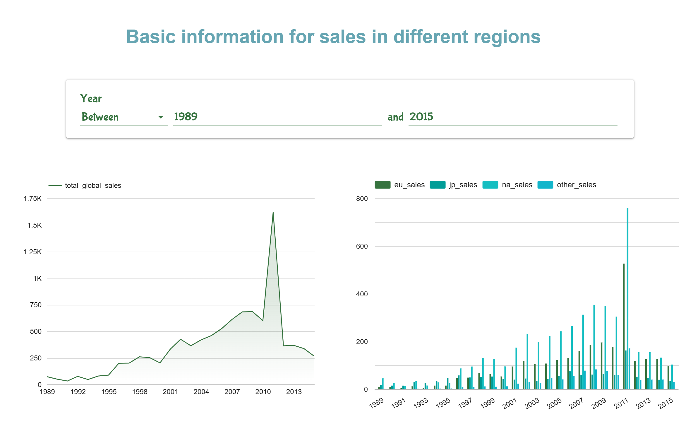
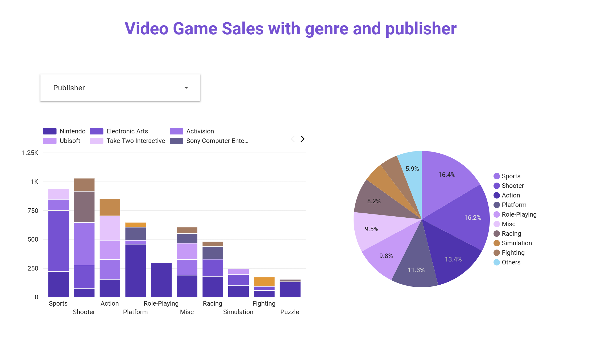

# 🎮 Video Game Sales Analysis Pipeline

## 📌 Project Overview

This project explores the relationship between video game global sales and platforms across different years. With over 16,000 video game records that include region-wise sales (NA, EU, JP, Other), platform, genre, publisher, and release year, the objective is to analyze how platform popularity evolved and contributed to total sales over time.

Understanding these trends is beneficial for game developers, marketers, and business analysts — helping identify which platforms dominated sales in specific years, which genres were most profitable, and which publishers led the market. This project constructs a full cloud-based data pipeline that automates ingestion, transformation, and visualization of these trends.

---

## ☁️ Cloud Architecture & Tools Used

| Layer | Tool |
|------|------|
| Workflow Orchestration | **Kestra** |
| Storage | **Google Cloud Storage (GCS)** |
| Data Warehouse | **BigQuery** |
| Transformation | **dbt** |
| Visualization | **Looker Studio** |

---

## 🗂️ Data Ingestion & Workflow (Batch Pipeline)

The data pipeline follows a **batch ingestion model** orchestrated using **Kestra**, designed as an end-to-end workflow:

1. **Source**:
   The video game sales data is collected from kaggle:
   [dataset](https://www.kaggle.com/datasets/anandshaw2001/video-game-sales).
   
   Parquet files (e.g., `game_sales_2000.parquet`) are pre-cleaned and splited by year in order to simulate batch process.
   The Parquet files are [here](https://github.com/shukew2/Video_game_sales_anaylsis/tree/main/data_year)
3. **Kestra Workflow**:
   - Copies Parquet files into Kestra's working directory
   - Uploads them to GCS under path `video_game_sales/yearly/<filename>`
   - Loads the files from GCS into BigQuery's raw table: `video_game_sales_raw`
   - Creates the final table `video_game` (partitioned and clustered) if it does not exist
   - Inserts new records for the selected year
 
**✅ Features**

- Fully automated DAG: No manual step required
- Supports dynamic year-based ingestion
- Simulates batch processing while supporting backfill

  Detail Process for Kestra pipeline can be found [here](https://github.com/shukew2/Video_game_sales_anaylsis/tree/main/Kestra)
---

## 🏢 Data Warehouse (BigQuery Design)

The final table `video_game` in BigQuery is optimized for analysis:

- **Partitioned by**: `Year` (Integer Range: 1980–2025)
- **Clustered by**: `Platform`, `Genre`

This structure enables:
- Efficient year-based filtering
- Fast platform/genre-based aggregation
- Reduced query cost for dashboard queries

---

## ⚙️ Transformations (dbt)

A dbt project was created to organize transformations and create clean analytical tables.

### Models Created:

| Model | Description |
|-------|-------------|
| `sales_by_year` | Global sales by year |
| `sales_by_platform_year` | Platform-level yearly sales |
| `sales_by_genre` | Global sales by genre |
| `sales_by_region_year` | NA, EU, JP, Other sales by year |
| `top_publishers_by_genre` | Top publishers in each genre by sales |

These models enable flexible querying and form the basis of the dashboard visuals.

Detail Process for dbt transformation can be found [here](https://github.com/shukew2/Video_game_sales_anaylsis/tree/main/dbt)

---

## 📊 Dashboard (Looker Studio)

    Link for the dashboards are [here](https://lookerstudio.google.com/reporting/530b29ec-e420-4546-a365-35cea43ecd46)
---

#### 🌍 Regional Sales Overview (1989–2015)

This section provides an overview of video game sales across major regions: North America, Europe, Japan, and other markets.  

- The **area chart** on the left tracks the evolution of global sales over time, highlighting growth and decline trends.
- The **bar chart** on the right breaks down yearly sales by region, allowing comparison of regional markets.
- A **year range filter** lets users dynamically explore historical changes between 1989 and 2015.

  
---
#### 💻 Platform Sales Distribution

This section of the dashboard visualizes how video game sales are distributed across different gaming platforms (e.g., PS3, X360, Wii) during different years.

- The **stacked bar chart** shows each platform’s total sales per year, allowing for a year-by-year comparison.
- The **donut chart** on the right aggregates total sales by platform, making it easy to see which platforms dominated globally in the selected period.
- A **year range filter** allows users to explore platform performance in different time windows.
  
  
---
#### 🎮 Video Game Sales by Genre and Publisher

This section explores how global video game sales are distributed across different genres and which publishers dominate each category.

- The **bar chart** on the left shows the total sales per genre, segmented by top publishers such as Nintendo, Activision, Ubisoft, and more.
- The **pie chart** on the right shows the overall share of each game genre in the global market, providing a quick snapshot of genre popularity.

Users can interact with the filter to focus on specific publishers and observe their market presence across genres.

---

## 🛠️ How to Run

1. Setting GCP properties in Kestra
2. Trigger Kestra flow (`video_game_sales_upload`) with desired year
3. Confirm data arrives in BigQuery table `video_game`
4. Run dbt transformations
5. Open Looker Studio and connect to BigQuery `video_game` models

## 🧾 Author

Created by [Shuke Wang] as part of Data Engineering Zoomcamp   
Project Timeline: January 2025 -- April 2025
